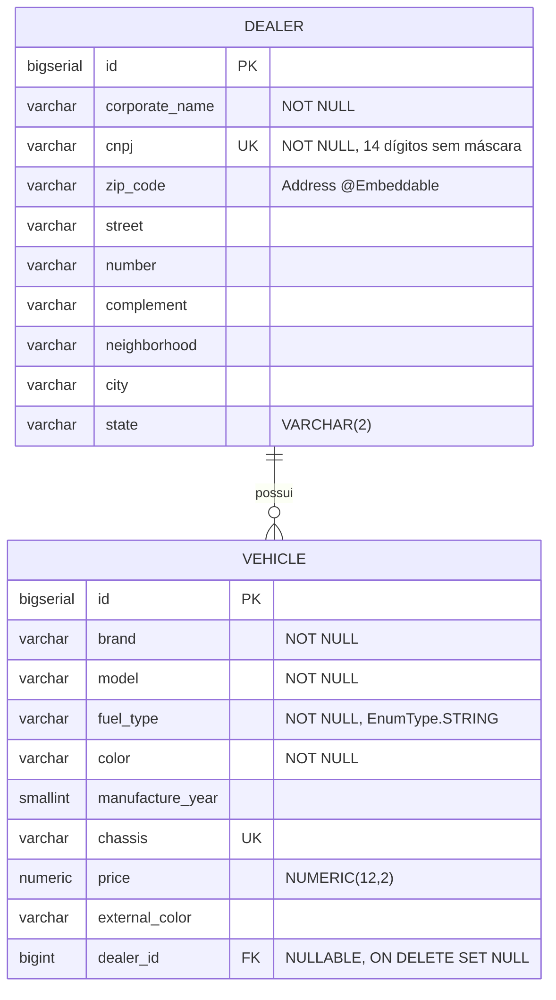

# Sistema de Gestão de Veículos e Concessionárias

Sistema para gestão comercial de veículos e concessionárias de montadora automobilística.
Backend em **Java 21 / Spring Boot 4.1.1**, frontend em **React 19 + TypeScript (Vite + Tailwind)**
e containerização completa com **Docker Compose**.

---

## 🛠️ Stack

### Backend
- **Java 21** & **Spring Boot 4.1.1** (Spring Framework 7)
- **Spring Data JPA / Hibernate 7**
- **PostgreSQL 17** com **Flyway** para migrações versionadas
- **Bean Validation** com validador customizado `@Cnpj` (algoritmo Módulo 11)
- **Spring Boot Actuator** (`health`, `info`, `flyway`)
- **springdoc-openapi** (Swagger UI)
- **Testes**: JUnit 5, Mockito, Testcontainers, ArchUnit

### Frontend
- **React 19** + **TypeScript** + **Vite**
- **Tailwind CSS** + **Lucide Icons**
- **TanStack Query** (estado assíncrono e invalidação de cache)
- **React Hook Form** + **Zod** (validação client-side)
- **Axios** com interceptor que normaliza respostas RFC 7807
- **Sonner** (notificações)
- **Testes**: Vitest + Testing Library

---

## 🚀 Como executar

### Via Docker Compose (recomendado)

```bash
docker compose up --build
```

| Serviço | URL |
|---|---|
| Frontend | http://localhost |
| API | http://localhost:8080 |
| Swagger UI | http://localhost:8080/swagger-ui.html |
| Health check | http://localhost:8080/actuator/health |

Para parar:

```bash
docker compose down      # para os containers, preserva os dados
docker compose down -v   # para os containers e APAGA o volume do banco
```

### Desenvolvimento local

**Pré-requisitos:** Docker, JDK 21+, Node.js 22+.

Backend — o módulo `spring-boot-docker-compose` sobe o PostgreSQL de `backend/compose.yaml`,
descobre a porta mapeada e injeta o datasource. Não há URL de banco configurada para o
ambiente de desenvolvimento:

```powershell
cd backend
.\mvnw.cmd spring-boot:run
.\mvnw.cmd clean test        # requer Docker rodando (Testcontainers)
.\mvnw.cmd spotless:apply    # formatação e remoção de imports não usados
```

Frontend:

```powershell
cd frontend
npm install
npm run dev
npm test
npm run lint
```

---

## 🗄️ Modelo de dados

Relação **Concessionária 1 — N Veículo**, opcional do lado do veículo.



Três decisões concentradas aqui:

**`dealer_id` é nullable.** Um veículo pode existir em estoque sem concessionária, o que
transforma "associar" em operação explícita (`PATCH /vehicles/{id}/dealer`) em vez de efeito
colateral do cadastro.

**`ON DELETE SET NULL`.** Excluir uma concessionária desvincula os veículos em vez de
destruir o estoque.

**`fuel_type` gravado como texto** (`EnumType.STRING`). Com `ORDINAL`, reordenar ou inserir
uma constante mudaria silenciosamente o significado de toda linha já persistida.

Detalhes e regras de negócio em [docs/domain/business_rules.md](docs/domain/business_rules.md).

---

## 📡 Endpoints

Todas as respostas de erro seguem **RFC 7807** (`application/problem+json`).

| Método | Endpoint | Descrição | Sucesso |
|---|---|---|---|
| `GET` | `/dealer` | Lista concessionárias | `200` |
| `GET` | `/dealer/{id}` | Busca por ID | `200` · `404` |
| `POST` | `/dealer` | Cadastra | `201` + `Location` · `409` · `422` |
| `PUT` | `/dealer/{id}` | Atualiza | `200` · `404` · `409` · `422` |
| `DELETE` | `/dealer/{id}` | Remove (desassocia veículos) | `204` · `404` |
| `GET` | `/dealer/{id}/vehicles` | Veículos da concessionária | `200` · `404` |
| `GET` | `/vehicles` | Lista (`?dealerId=` · `?unassigned=true`) | `200` |
| `GET` | `/vehicles/{id}` | Busca por ID | `200` · `404` |
| `POST` | `/vehicles` | Cadastra | `201` + `Location` · `404` · `409` · `422` |
| `PUT` | `/vehicles/{id}` | Atualiza | `200` · `404` · `409` · `422` |
| `PATCH` | `/vehicles/{id}/dealer` | Associa ou desassocia (`{"dealerId": 1}` ou `null`) | `200` · `404` |
| `DELETE` | `/vehicles/{id}` | Remove | `204` · `404` |
| `GET` | `/addresses/{zipCode}` | Consulta CEP via proxy ViaCEP | `200` · `404` · `409` |

Erros de validação incluem um objeto `errors` com o mapa campo → mensagem, consumido
diretamente pelo `setError` do React Hook Form:

```json
{
  "type": "about:blank",
  "title": "Erro de validação",
  "status": 422,
  "detail": "Um ou mais campos são inválidos",
  "errors": {
    "corporateName": "Razão social é obrigatória",
    "cnpj": "CNPJ inválido"
  }
}
```

Coleção de requisições executáveis em [`backend/http/api.http`](backend/http/api.http)
(extensão REST Client do VS Code). Contratos detalhados em
[docs/api/endpoints.md](docs/api/endpoints.md).

---

## 🏛️ Padrões e qualidade

- **Arquitetura em camadas com pacotes por feature**: `Controller → Service → Repository`,
  dependências apontando apenas para baixo. Não é hexagonal nem clean architecture — o
  trade-off está registrado em [ADR-006](docs/architecture/adrs.md).
- **Regras de dependência verificadas em build**: 9 regras ArchUnit em `ArchitectureTest`
  quebram o build se um service importar a camada web, um controller acessar repositório
  direto ou uma entidade conhecer um DTO. Não é convenção documentada, é teste.
- **Controllers finos**: sem regra de negócio, sem acesso a repositório, sem `try/catch`.
  Todos abaixo de 60 linhas — os códigos de erro semânticos são decididos no service.
- **Injeção por construtor apenas**, sem `@Autowired` em campo (verificado por
  `ArchitectureTest.no_field_injection`): campos `final`, dependência garantida pelo
  compilador, e services testáveis com `new` sem contexto Spring.
- **Camada de serviço e transações**: `@Transactional(readOnly = true)` nas leituras;
  atualização por dirty checking, sem `save()` explícito dentro da transação.
- **DTOs e mappers escritos à mão**: classes `final` com métodos `static`, sem Lombok nem
  MapStruct. A prioridade foi poder explicar cada linha, não reduzir boilerplate. Com dois
  agregados o custo é baixo; em domínio maior eu adotaria MapStruct, que gera código em tempo
  de compilação e falha o build em campo não mapeado — a principal fragilidade do mapeamento
  manual, coberta aqui por teste.
- **Tratamento de exceções centralizado**: `GlobalExceptionHandler` mapeia exceções de domínio
  e do Spring MVC para `ProblemDetail`. Stack trace vai para o log, nunca para a resposta.
- **Mapeamento JPA**: `Address` como `@Embeddable`, `@ManyToOne(fetch = LAZY)` sem cascade,
  `@EntityGraph` contra N+1 na listagem de veículos, `ddl-auto: validate` (o Flyway é dono do
  schema, o Hibernate apenas confere), `BigDecimal` para valores monetários.
- **Validação em duas camadas**: Zod no cliente para feedback imediato, Bean Validation no
  servidor como autoridade. O algoritmo Módulo 11 do CNPJ está implementado nas duas pontas.
- **Segurança de rede**: `InetAddressFilter.externalAddresses()` restringe chamadas de saída a
  endereços públicos. O CEP é entrada do usuário alimentando uma requisição externa — sem o
  filtro, um valor forjado poderia alcançar loopback, faixas privadas ou endpoint de metadados
  de nuvem.

Detalhamento de SOLID com referências de arquivo em
[docs/architecture/solid.md](docs/architecture/solid.md).

---

## 📊 Observabilidade

- `logging.structured.format.console: ecs` no perfil `docker` — logs em JSON nativos do
  Spring Boot 4, sem dependência extra nem `logback-spring.xml`.
- `CorrelationIdFilter` lê ou gera um `X-Correlation-Id`, coloca no MDC e devolve no header,
  permitindo amarrar todas as linhas de log de uma mesma requisição.
- Nenhum log carrega CNPJ ou outro dado de identificação — apenas ids.
- `/actuator/health`, `/actuator/info` e `/actuator/flyway` expostos explicitamente.

---

## 📄 Documentação

Índice completo em [docs/](docs/README.md).

- [Visão geral e camadas](docs/architecture/overview.md) — diagramas, fluxo de requisição
- [Decisões de arquitetura (ADRs)](docs/architecture/adrs.md)
- [SOLID aplicado](docs/architecture/solid.md)
- [Regras de negócio](docs/domain/business_rules.md)
- [Especificação de endpoints](docs/api/endpoints.md)
- [Integração ViaCEP e SSRF](docs/api/viacep.md)
- [Estratégia de testes](docs/tests/test_strategy.md)
- [Docker e containerização](docs/infra/docker.md)