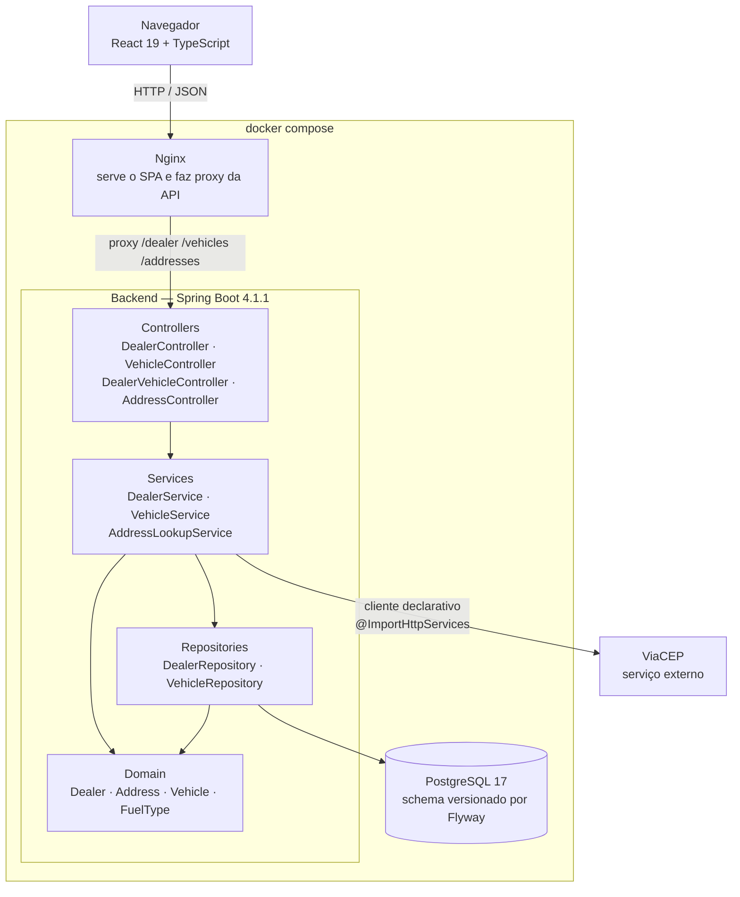
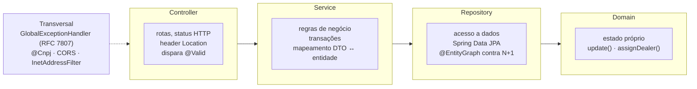
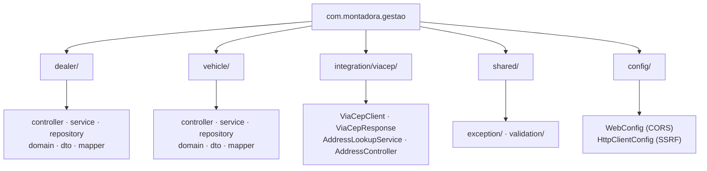
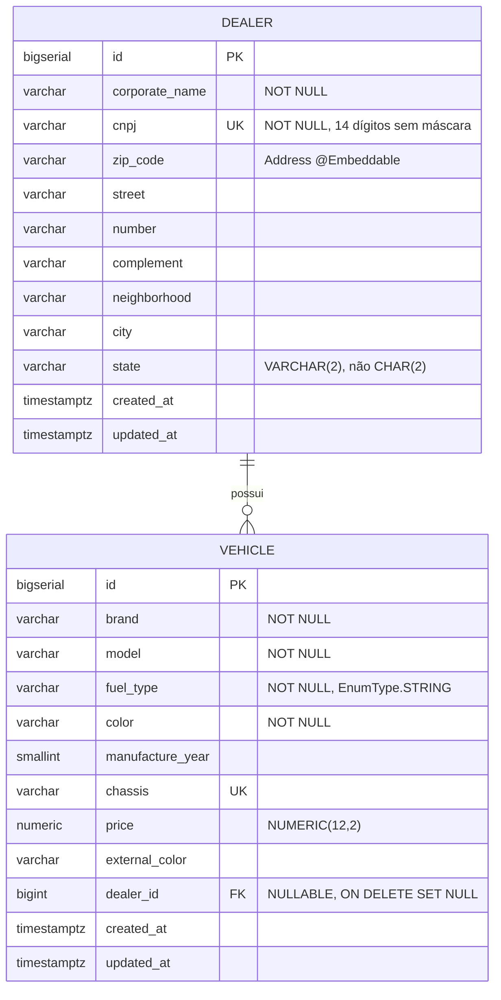
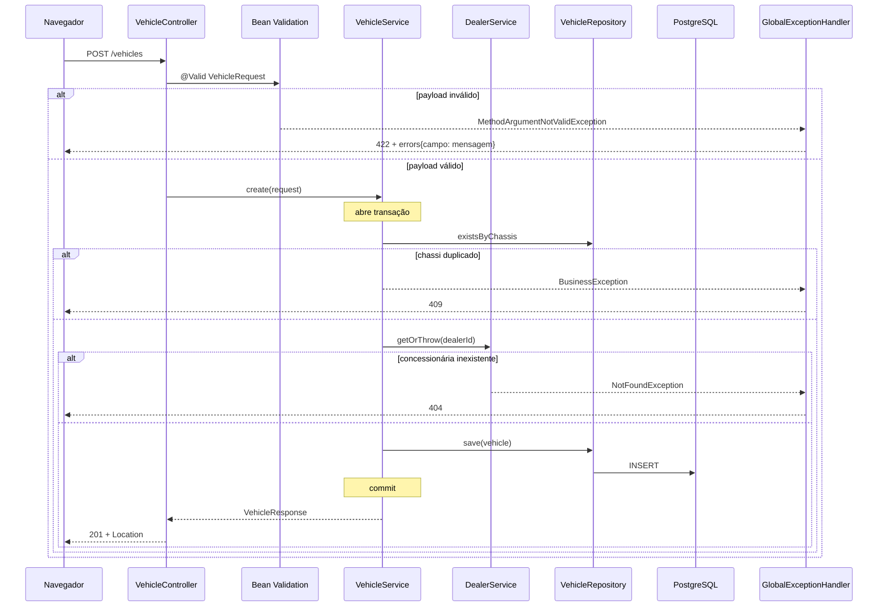

# Visão Geral e Camadas

Arquitetura em camadas organizada por feature (vertical slices). Não é hexagonal
nem clean architecture — a justificativa está em [ADR-001](adrs.md).

## Diagrama de containers

## Camadas e responsabilidades

As dependências apontam **somente para baixo**. Isso não é convenção
documentada: está verificado em
[`ArchitectureTest`](../../backend/src/test/java/com/montadora/gestao/architecture/ArchitectureTest.java),
que quebra o build se um service importar a camada web ou uma entidade importar
um DTO.

## Estrutura de pacotes

Cada feature nova recebe um pacote de primeiro nível com a mesma forma interna.
Pacote por camada (`controllers/`, `services/` na raiz) espalharia uma única
mudança de feature por seis diretórios.

## Modelo de dados

Três decisões concentradas nesse diagrama:

**`dealer_id` é nullable.** Um veículo pode existir em estoque sem
concessionária. Isso transforma "associar" em operação explícita
(`PATCH /vehicles/{id}/dealer`) em vez de efeito colateral do cadastro.

**`ON DELETE SET NULL`.** Excluir uma concessionária desvincula os veículos em
vez de destruir o estoque.

**`fuel_type` como `VARCHAR` com `EnumType.STRING`.** Com `ORDINAL`, reordenar
ou inserir uma constante mudaria silenciosamente o significado de toda linha já
gravada.

## Fluxo de uma requisição

`POST /vehicles` com `dealerId: 1`:

## Fronteiras explícitas

**DTOs na borda.** Entidades nunca saem da camada de service. Três motivos
concretos: evita loop infinito de serialização no `@ManyToOne`, desacopla o
contrato da API do schema do banco, e impede vazamento de campos internos
(`created_at`, `updated_at`). `VehicleResponse` carrega um `DealerSummary`
(id + razão social), nunca a entidade `Dealer`.

**Camada anticorrupção em `integration/viacep`.** `ViaCepResponse` espelha o
JSON do provedor (chaves em português, flag `erro`). `AddressLookupService`
traduz para `AddressLookupResponse`, que é nosso. Nada fora desse pacote —
incluindo o frontend — sabe que o ViaCEP existe. Trocar de provedor mexe em um
pacote. Detalhes em [ViaCEP e SSRF](../api/viacep.md).