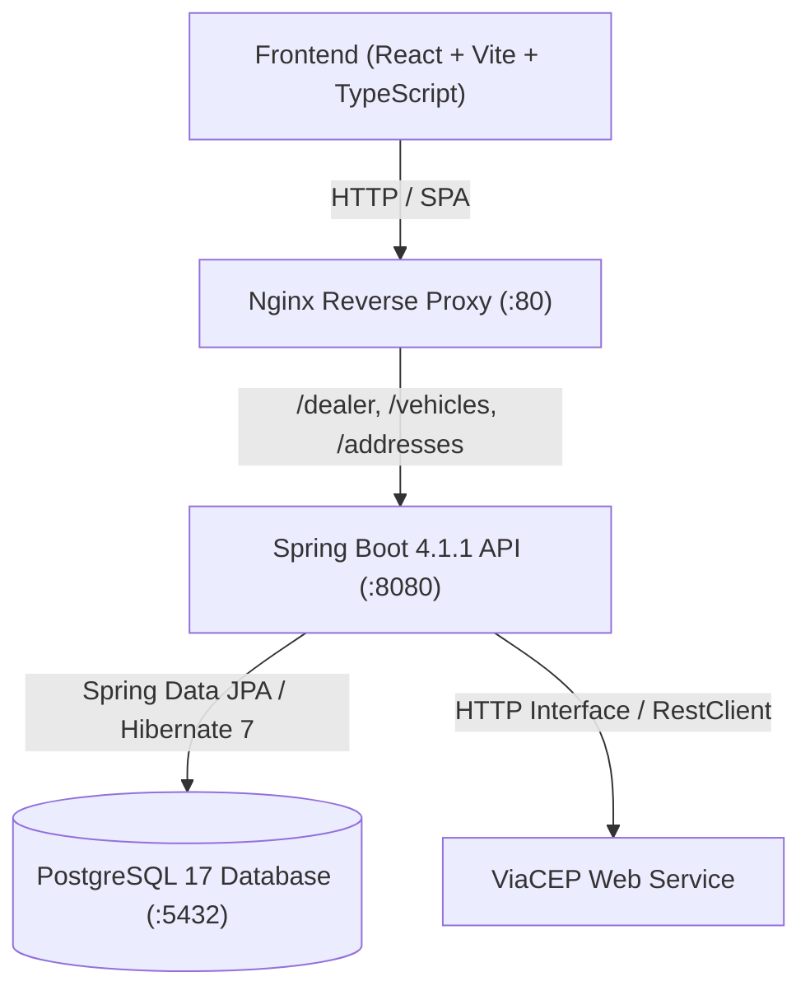
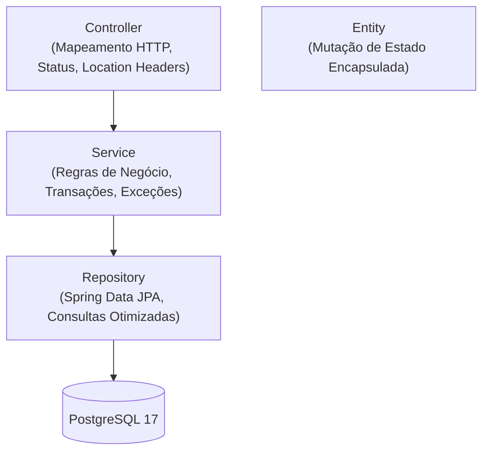

# Visão Geral da Arquitetura

O sistema foi desenhado seguindo os princípios de **Clean Architecture**, **SOLID** e separação de responsabilidades em camadas bem delimitadas (**Feature-First**).

---

## 1. Diagrama Geral do Sistema



---

## 2. Estrutura de Pacotes (Feature-First)

A organização do backend prioriza o agrupamento por contexto de domínio (`com.montadora.gestao`):

```
com.montadora.gestao
├── config/                  # Configurações globais (CORS, SSRF Filter)
├── shared/
│   ├── exception/          # Tratamento de exceções e mapeamento RFC 7807
│   └── validation/         # Validação customizada @Cnpj
├── dealer/                 # Domínio de Concessionárias
│   ├── domain/             # Entidade Dealer, Embeddable Address
│   ├── repository/         # DealerRepository
│   ├── dto/                # Records de entrada/saída (DTOs)
│   ├── mapper/             # DealerMapper (métodos estáticos puros)
│   ├── service/            # Regras de negócio e transações (@Transactional)
│   └── controller/         # Endpoints HTTP (< 50 linhas)
├── vehicle/                # Domínio de Veículos
│   ├── domain/             # Entidade Vehicle, Enum FuelType
│   ├── repository/         # VehicleRepository (@EntityGraph anti-N+1)
│   ├── dto/                # VehicleRequest, VehicleResponse, AssignDealerRequest
│   ├── mapper/             # VehicleMapper
│   ├── service/            # VehicleService
│   └── controller/         # VehicleController
└── integration/
    └── viacep/             # Integração HTTP com ViaCEP (@ImportHttpServices)
```

---

## 3. Camadas e Fluxo de Dependências



- **Controller**: Trata apenas protocolo HTTP. Não contém lógica de negócio nem `try-catch` redundante (tratado globalmente).
- **Service**: Conduz transações (`@Transactional(readOnly = true)` para leituras), regras de validação de negócio e orquestração.
- **Repository**: Spring Data JPA. Uso de `@EntityGraph` para evitar N+1 em associações Lazy.
- **Entity**: Métodos ricos de alteração de estado (`update()`, `assignDealer()`). Sem anotações do Lombok.
