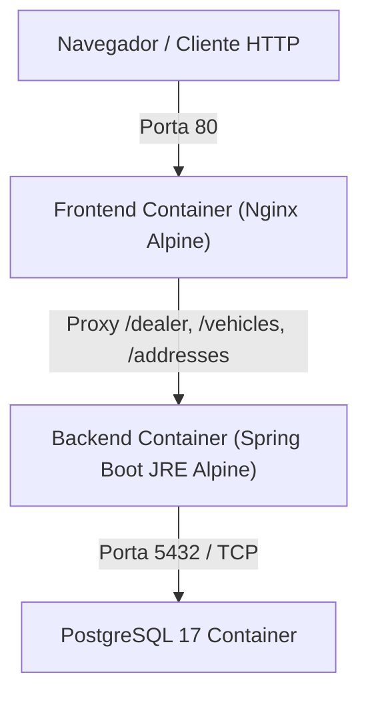

# Infraestrutura & Containerização (Docker)

O projeto disponibiliza uma solução completa de containerização com **Docker** e **Docker Compose**, permitindo a execução imediata de todo o ecossistema com um único comando.

---

## 1. Arquitetura dos Containers



---

## 2. Componentes

### PostgreSQL (`gestao-postgres`)
- Imagem: `postgres:17-alpine`
- Healthcheck ativo via `pg_isready` para garantir que o banco esteja pronto antes da inicialização do backend.
- Persistência em volume nomeado `postgres_data`.

### Backend (`gestao-backend`)
- Imagem base: `eclipse-temurin:21-jre-alpine`
- Multi-stage build no `backend/Dockerfile` (fase de compilação com Maven + JDK 21 e imagem final enxuta com JRE).
- Execução como usuário não-root (`spring:spring`).
- Healthcheck via Actuator: `/actuator/health`.

### Frontend (`gestao-frontend`)
- Imagem base: `nginx:alpine`
- Multi-stage build no `frontend/Dockerfile` (`node:22-alpine` para gerar o bundle do Vite + Nginx para servir estáticos).
- Reverse Proxy configurado no `nginx.conf` para rotear chamadas da API diretamente para o container do backend.

---

## 3. Comandos Úteis

```bash
# Subir todo o ambiente compilando imagens
docker compose up --build

# Parar os containers e remover volumes
docker compose down -v

# Verificar status e logs
docker compose ps
docker compose logs -f backend
```
